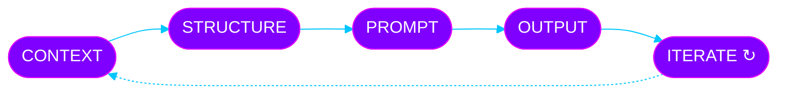
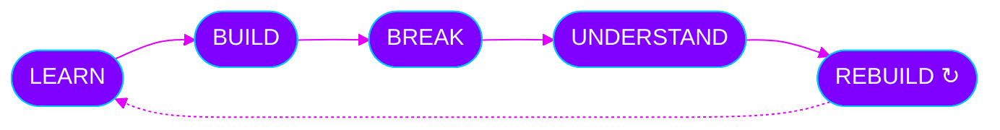

<!-- ═══════════════════════════════════════════════════════════
     MANPREET SINGH · STARBOY · GitHub Profile README
     Palette: #7F00FF (violet) · #E100FF (magenta) · #00C6FF (cyan)
     ═══════════════════════════════════════════════════════════ -->

<a id="top"></a>

<div align="center">


<br>


<br><br>

**B.Tech CSE Student · Developer · AI Explorer · Prompt Engineer**

*Building at the intersection of code, AI, creativity, and curiosity.*

<br>

[](https://github.com/mxnpreet7)
[](https://www.linkedin.com/in/manpreet-singh-7063703b2/)
[](https://www.instagram.com/thmnprt/)
[](mailto:iammanpreet640@gmail.com)

<br>

**[ABOUT](#about)** · **[EXPLORING](#exploring)** · **[AI](#ai)** · **[STACK](#stack)** · **[PROJECTS](#projects)** · **[GITHUB](#github)** · **[INTERESTS](#interests)** · **[CONNECT](#connect)**

</div>


<a id="about"></a>

## `01` &nbsp;ABOUT

<table>
<tr>
<td width="58%" valign="top">

### Hey, I'm **Manpreet** 👋

I'm a **Computer Science & Engineering student at SVIET, Chandigarh**, exploring the space between software, artificial intelligence, design, and creativity.

I learn by building: take an idea, break it apart, experiment with it, and turn it into something usable.

</td>
<td width="42%" valign="top" align="center">

<br>
<br>
<br>


</td>
</tr>
</table>

```js
const manpreet = {
  alias:    "STARBOY",
  role:     "B.Tech CSE Student @ SVIET",
  location: "Chandigarh, India",
  languages: ["C", "C++", "Python", "Java"],
  building:  ["Web", "AI workflows", "Prompt systems"],
  mindset:   "Build first. Document honestly. Improve constantly.",
  currentlyLearning: () => "everything worth understanding",
};
```

<a id="exploring"></a>

## `02` &nbsp;CURRENTLY EXPLORING

<div align="center">

<table>
<tr>
<td align="center" width="25%">

### 🤖
**ARTIFICIAL<br>INTELLIGENCE**

Generative AI<br>Machine Learning

</td>
<td align="center" width="25%">

### ⚡
**PROMPT<br>ENGINEERING**

Context Engineering<br>AI Workflows

</td>
<td align="center" width="25%">

### 🌐
**WEB<br>DEVELOPMENT**

Full-Stack<br>Modern Interfaces

</td>
<td align="center" width="25%">

### 🧠
**DATA &<br>CREATIVITY**

Data Science<br>Creative Technology

</td>
</tr>
</table>

</div>


<a id="ai"></a>

## `03` &nbsp;AI × PROMPT ENGINEERING

<div align="center">


</div>

> **I don't see AI as a replacement for learning code. I see it as a multiplier for curiosity.**

I enjoy designing structured interactions between humans and AI systems.



<table>
<tr>
<td width="50%" valign="top">

**Exploring**

`GENERATIVE AI` · `MACHINE LEARNING`<br>
`AI TOOLS` · `AI-ASSISTED DEVELOPMENT`

</td>
<td width="50%" valign="top">

**Areas of interest**

Structured prompting · Context engineering<br>
Iterative prompting · Research workflows<br>
Productivity systems

</td>
</tr>
</table>


<a id="stack"></a>

## `04` &nbsp;TECH STACK

<div align="center">

**LANGUAGES**<br>


<br><br>

**DEVELOPMENT**<br>


<br><br>

**AI / TOOLS**<br>


</div>

<br>

<div align="center">

| `CODE` | `BUILD` | `THINK` | `EXPLORE` |
|:---:|:---:|:---:|:---:|
| C++ · Python · C · Java | HTML · CSS · JS · React | AI · Problem Solving | ML · Data · UI/UX |

*No fake percentages. No inflated skill bars. Just what I'm actively learning and using.*

</div>


<a id="projects"></a>

## `05` &nbsp;PROJECTS

<div align="center">


</div>

Rather than filling this section with invented projects, I let real work earn its place here.

<table>
<tr>
<td width="50%" valign="top">

### 🚧 BUILDING
- Academic projects
- Web experiments
- AI experiments
- Developer tools

</td>
<td width="50%" valign="top">

### 🔬 EXPERIMENTING
- AI workflows
- Prompt engineering
- Modern interfaces
- Creative technology

</td>
</tr>
</table>

<!--
  PINNED REPO CARDS — uncomment once you have repos to show.
  Replace YOUR_REPO with the exact repository name.

<div align="center">
<a href="https://github.com/mxnpreet7/YOUR_REPO">
  
</a>
</div>
-->

<a id="learning"></a>

### 🔁 Learning philosophy

*I learn best when theory meets implementation.*




<a id="github"></a>

## `06` &nbsp;GITHUB

<div align="center">


<br>


<br>


<br><br>


<br>

> **Small commits. Long-term compounding.**

[](https://github.com/mxnpreet7)

</div>


<a id="interests"></a>

## `07` &nbsp;PERSONAL INTERESTS

<div align="center">

<table>
<tr>
<td align="center">🎧<br><b>MUSIC</b></td>
<td align="center">📚<br><b>BOOKS</b></td>
<td align="center">👔<br><b>FASHION</b></td>
<td align="center">💻<br><b>TECH</b></td>
</tr>
<tr>
<td align="center">🤖<br><b>AI</b></td>
<td align="center">🌍<br><b>EXPLORATION</b></td>
<td align="center">🎮<br><b>GAMING</b></td>
<td align="center">🧠<br><b>PSYCHOLOGY</b></td>
</tr>
</table>

</div>

<table>
<tr>
<td width="50%" valign="top">

### 🎧 On repeat
`Lana Del Rey` · `Billie Eilish` · `The Weeknd`

</td>
<td width="50%" valign="top">

### 📚 Meaningful reads
`The Art of Being Alone` · `Atomic Habits`

</td>
</tr>
</table>


## `08` &nbsp;STARBOY

<div align="center">


</div>

<a id="connect"></a>

## `09` &nbsp;LET'S CONNECT

<div align="center">

Got an idea, a collab, or just want to talk AI, code, or design? Reach out.

[](https://github.com/mxnpreet7)
[](https://www.linkedin.com/in/manpreet-singh-7063703b2/)
[](https://www.instagram.com/thmnprt/)
[](mailto:iammanpreet640@gmail.com)

<br>

**[↑ Back to top](#top)**


</div>
