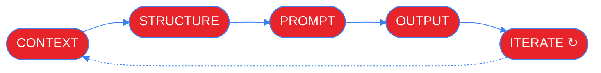
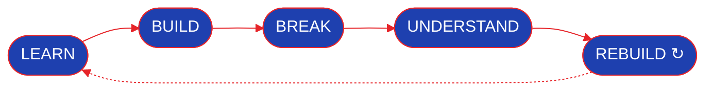

<!-- ═══════════════════════════════════════════════════════════
     MANPREET SINGH · STARBOY · Spider-Verse themed README
     Palette: #E62429 (suit red) · #1E40AF (deep blue) · #3B82F6 (web blue)
              #0B0F1A (night-city black) · #FFFFFF
     No official logos or artwork used: colour, type and emoji only.
     ═══════════════════════════════════════════════════════════ -->

 

  

**B.Tech CSE Student · Developer · AI Explorer · Prompt Engineer**

*Building at the intersection of code, AI, creativity, and curiosity.*

 

 

**[ORIGIN](#about)** · **[SUIT UP](#exploring)** · **[WEB OF AI](#ai)** · **[GADGETS](#stack)** · **[MISSIONS](#projects)** · **[STATS](#github)** · **[OFF-DUTY](#interests)** · **[SWING BY](#connect)**

 

🕷️ ━━━━━━━━━ 🕸️ ━━━━━━━━━ 🕷️

<table>
<tr>
<td width="58%" valign="top">

### Hey, I'm **Manpreet** 👋

I'm a **Computer Science & Engineering student at SVIET, Chandigarh**, exploring the space between software, artificial intelligence, design, and creativity.

I learn by building: take an idea, break it apart, experiment with it, and turn it into something usable.

</td>
<td width="42%" valign="top" align="center">

 
 
 

</td>
</tr>
</table>

# 👋 Hi, I'm STARBOY

<alias:       STARBOY>
role:        B.Tech CSE Student @ SVIET
location:    Chandigarh, India
languages:   C, C++, Python, Java
swinging:    Web, AI workflows, Prompt systems
motto:       Great prompts come with great responsibility.
spiderSense: tingles when the code has a bug

> 🕸️ *"Great prompts come with great responsibility."*

<table>
<tr>
<td align="center" width="25%">

### 🤖
**ARTIFICIAL INTELLIGENCE**

Generative AI Machine Learning

</td>
<td align="center" width="25%">

### ⚡
**PROMPT ENGINEERING**

Context Engineering AI Workflows

</td>
<td align="center" width="25%">

### 🌐
**WEB DEVELOPMENT**

Full-Stack Modern Interfaces

</td>
<td align="center" width="25%">

### 🧠
**DATA & CREATIVITY**

Data Science Creative Technology

</td>
</tr>
</table>

> **I don't see AI as a replacement for learning code. I see it as a multiplier for curiosity.**

I enjoy designing structured interactions between humans and AI systems.

<table>
<tr>
<td width="50%" valign="top">

**Exploring**

`GENERATIVE AI` · `MACHINE LEARNING` 
`AI TOOLS` · `AI-ASSISTED DEVELOPMENT`

</td>
<td width="50%" valign="top">

**Areas of interest**

Structured prompting · Context engineering 
Iterative prompting · Research workflows 
Productivity systems

</td>
</tr>
</table>

**LANGUAGES** 

  

**DEVELOPMENT** 

  

**AI / TOOLS** 

  

| `CODE` | `BUILD` | `THINK` | `EXPLORE` |
|:---:|:---:|:---:|:---:|
| C++ · Python · C · Java | HTML · CSS · JS · React | AI · Problem Solving | ML · Data · UI/UX |

*No fake percentages. No inflated skill bars. Just what I'm actively learning and using.*

Rather than filling this section with invented projects, I let real work earn its place here.

<table>
<tr>
<td width="50%" valign="top">

### 🚧 ON PATROL
- Academic projects
- Web experiments
- AI experiments
- Developer tools

</td>
<td width="50%" valign="top">

### 🔬 IN THE LAB
- AI workflows
- Prompt engineering
- Modern interfaces
- Creative technology

</td>
</tr>
</table>

<!--
  PINNED REPO CARDS: uncomment once you have repos to show.
  Replace YOUR_REPO with the exact repository name.

-->

### 🔁 Learning loop

*I learn best when theory meets implementation.*

> **Small commits. Long-term compounding.**

<table>
<tr>
<td align="center">🎧 <b>MUSIC</b></td>
<td align="center">📚 <b>BOOKS</b></td>
<td align="center">👔 <b>FASHION</b></td>
<td align="center">💻 <b>TECH</b></td>
</tr>
<tr>
<td align="center">🤖 <b>AI</b></td>
<td align="center">🌍 <b>EXPLORATION</b></td>
<td align="center">🎮 <b>GAMING</b></td>
<td align="center">🧠 <b>PSYCHOLOGY</b></td>
</tr>
</table>

<table>
<tr>
<td width="50%" valign="top">

### 🎧 On repeat
`Lana Del Rey` · `Billie Eilish` · `The Weeknd`

</td>
<td width="50%" valign="top">

### 📚 Meaningful reads
`The Art of Being Alone` · `Atomic Habits`

</td>
</tr>
</table>

Got an idea, a collab, or just want to talk AI, code, or design? Reach out.

 

🕷️ ━━━━━━━━━ 🕸️ ━━━━━━━━━ 🕷️

**[↑ Back to top](#top)**

